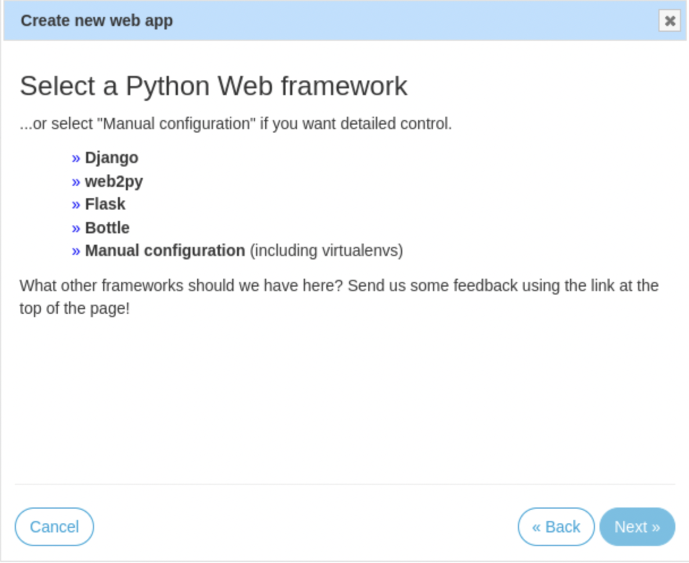

# デプロイ
## 概要
Djangoで作成された本アプリをPythonAnywhereにデプロイする手順をまとめる（本リポジトリに限らない）．`pa_autoconfigure_django.py`を用いれば簡単であるとする文献も見られるが，個別の設定（`settings.py`における`SECRET_KEY`や`DEBUG`など）をGitHubにあげていない場合などはコマンド一つでは設定できなかったり`settings.py`が勝手に変更されたりして，管理上面倒であるので使わない．

## Djangoでアプリ作成
何でも良いが，以下の点に注意する．

- `requirements.txt`を用意する（しないで一つづつ`pip3 install`しても良いが面倒）．
- GitHubにpushする（`pa_autoconfigure_django.py`を用いるなら`BASE_DIR`に`.git`が存在するようにするが，用いないので必須では無い）．
 	- gitによる管理の対象外のファイル（`SECRET_KEY`などが記述された`settings_local.py`など）が存在してもかまわない．
	- `ALLOWD_HOSTS`をあとで設定しないといけないのでなんらかの対応は必要
- 本番環境であるので`settings.py`で`STATIC_ROOT`を設定しておく．`os.path.join(BASE_DIR,'static')`が無難．`STATICFILES_DIRS`と指定先が被らないようにする．
	- `pa_autoconfigure_django.py`を用いる場合は`settings.py`の末尾に`STATIC_ROOT `の設定が勝手に追加されることがある（だから使いたくない）．
- データベースは無料でsqlite3とMySQLが利用可能であるが，今回はデフォルトのsqlite3とする．

## PythonAnywhereでアカウント作成
[PythonAnywhere](https://www.pythonanywhere.com/)にアクセスしてアカウントを作成する．とりあえず無料版（で検証した）．無料版の場合は公開するときのURLにユーザー名が入るからか，ユーザー名にはアルファベットと数字しか利用できない「.」など記号は不可）．

## 起動
以下は[公式のhelp](https://help.pythonanywhere.com/pages/DeployExistingDjangoProject/)に沿って進めていく．
#### コンソール
PythonAnywhereのログインしている場合のトップページ（Dashboard）で「$Bash」ボランを押すことでコンソールを起動する．このコンソールは起動時はBashだがZshも利用できる．しかし，Zshだと後述の`mkvirtualenv`コマンドが利用できなかったりするので注意．また，vimは`.vimrc`が最初から用意されていて最低限の記述はあるので，ちょっとした編集程度なら困らない．
#### アップロード
作成したアプリのGitHubリポジトリをクローンする．もし公開鍵認証が必要であれば`ssh-keygen`は利用可能である．場所はホームディレクトリが無難，ディレクトリ名は特に指定は無い（あとで合わせて設定する）．その後，gitの管理外のファイルがあれば用意する．そして`settings.py`の`ALLOWD_HOST`を設定する．無料版であれば`<username>.pythonanywhere.com`をリストに追加する．
```sh
cd
git clone https://github.com/<username>/<repository>.git
```
#### 仮想環境を構築
以下のコマンドで仮想環境を構築する．Bashで行なうこと．
```sh
mkvirtualenv --python=/usr/bin/python3.10 mysite-virtualenv
```
pythonのバージョンは他のものを選択しても良い．`mysite-virtualenv`の部分は何でも良い（あとで合わせて設定する）．
これで仮想環境になり，その状態でpipで必要なライブラリをインストールする．
```sh
pip3 install -r requirements.txt
```
こうしてインストールしたライブラリは仮想環境の中でしか利用できない．よって，コンソールを閉じたときなどして仮想環境から出てしまった場合は以下のようにアクティベートが必要である．
```
source ~/.virtualenvs/mysite-virtualenv/bin/activate
```
`mysite-virtualenv`の部分は先程設定したものに合わせる．
### manage.pyを用いた準備
`makemigrations`，`migrate`，`collectstatic`等を行なう（`collectstatic`により`STATIC_ROOT`で指定したディレクトリに静的ファイルを集約する）．
```
cd <BASE_DIR>
python3 manage.py makemigrations
python3 manage.py migrate
python3 manage.py collectstatic
```
#### 「Web」タブでの設定
PythonAnywhereのログインしている場合のページで上部で「Dashboard」などと並んでいるところにある「Web」をクリック．このページで「Add a new web app」から新しいアプリを作る．基本は案内に従うだけだが，「Select a Python Web framework」と表示されたときには「Django」ではなく「Manual configuration」を選択する．  
  
その後，「Web」タブで個別のアプリ（無料版ならそもそも一個しか作れないが）の設定ができるようになるので，「Virtualenv:」で先程作成した仮想環境を登録（`mysite-virtualenv`に相当する部分だけを入力して保存すると自動でフルパスに変えてもらえる模様）し，「Code:」の「Source code」で`manage.py`のある階層を指定する．さらに，「Static files」で`settings.py`の`STATIC_ROOT`に設定した階層と`STATIC_URL`に設定したURL，及び`MEDIA_ROOT`に設定した階層と`MEDIA_URL`で指定したURLを登録する．
#### WSGIファイルの編集
WSGIファイルを編集する．ただし，PythonAnywhereではDjangoの`wsgi`ファイルは読み込まれない（無視される）．代わりに`/var/www/<username>_pythonanywhere_com_wsgi.py`が読み込まれる．これの編集はコンソールからVimを用いてもいいが，「Web」タブで「Code:」の「WSGI configuration file:」にもあり，これをクリックするとエディターが開いて編集可能である．このファイルのDjangoのセクション以外をすべて削除したうえで，以下の二箇所をこれまでの設定に合わせて編集する．
```python
...
path = '/home/myusername/mysite'
...
os.environ['DJANGO_SETTINGS_MODULE'] = 'mysite.settings'
...
```
#### Reload
「Web」タブで，緑色の「Reload」ボタンを押してリロードして完了．

## 更新
何か変更（`git pull`含む）があった場合は，それを反映させるために再度「Web」タブで緑色の「Reload」ボタンを押す．また，`STATICFILES_DIRS`内の静的ファイルに変更があった場合はその前に`python3 manage.py collectstatic`が必要である．
