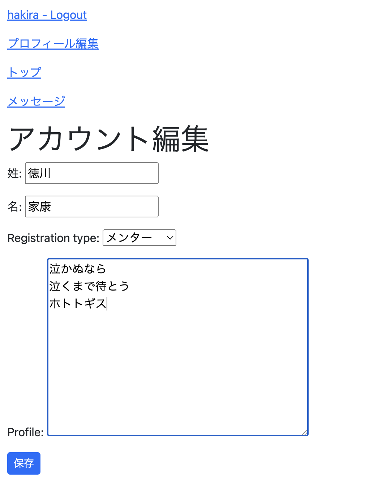
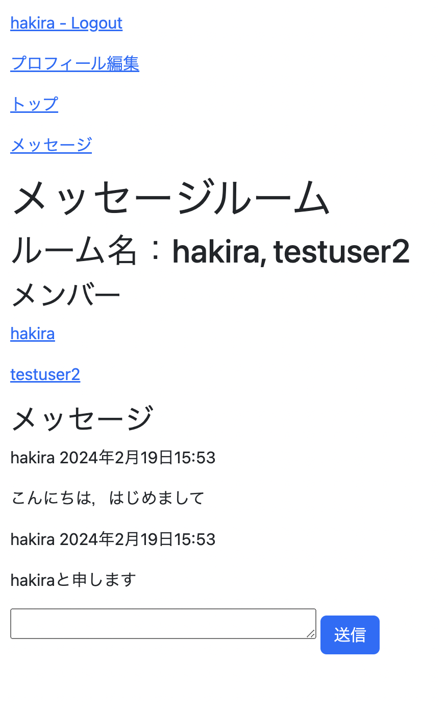

# 機能
概要で述べた通りメンターとメンティーのマッチングさせる機能がある．
より具体的には以下の２つからなる．

## プロフィール機能（一覧，表示，編集）
各自が自分のプロフィールを設定したり他人のプロフィールを閲覧したりできる．
デフォルトのユーザークラスではプロフィール情報を格納する
カラムを追加できないので**カスタムユーザーが必要**．

## DM機能
ダイレクトメッセージでやりとりができる．
**データベースをどのようにするかよく考える必要がある**．

